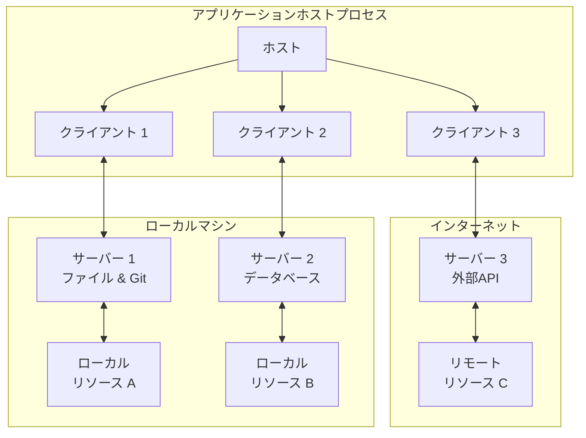
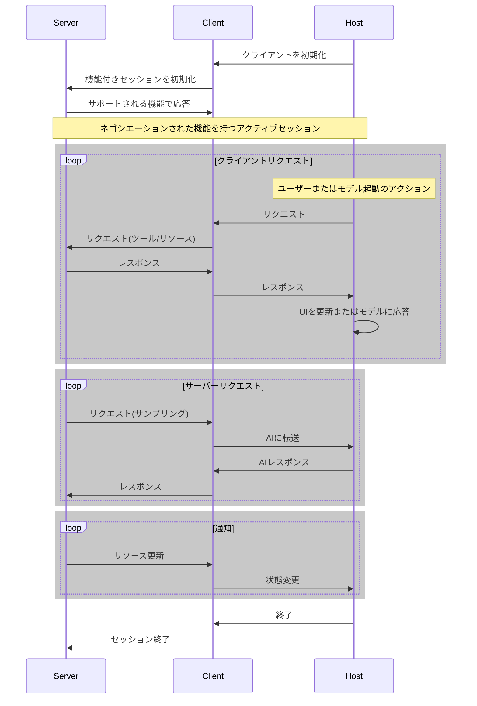

# Architecture

Model Context Protocol (MCP)は、各ホストが複数のクライアントインスタンスを実行できるクライアント-ホスト-サーバーアーキテクチャに従っています。このアーキテクチャにより、ユーザーはアプリケーション全体でAI機能を統合しながら、明確なセキュリティ境界を維持し、懸念事項を分離できます。JSON-RPCを基盤として、MCPはクライアントとサーバー間のコンテキスト交換とサンプリング調整に焦点を当てたステートフルなセッションプロトコルを提供します。

## コアコンポーネント

### ホスト

ホストプロセスはコンテナおよびコーディネーターとして機能します:

- 複数のクライアントインスタンスを作成・管理
- クライアント接続の権限とライフサイクルを制御
- セキュリティポリシーと同意要件を実施
- ユーザー認証の決定を処理
- AI/LLM統合とサンプリングを調整
- クライアント間のコンテキスト集約を管理

### クライアント

各クライアントはホストによって作成され、分離されたサーバー接続を維持します:

- サーバーごとに1つのステートフルセッションを確立
- プロトコルネゴシエーションと機能交換を処理
- プロトコルメッセージを双方向にルーティング
- サブスクリプションと通知を管理
- サーバー間のセキュリティ境界を維持

ホストアプリケーションは複数のクライアントを作成・管理し、各クライアントは特定のサーバーと1:1の関係を持ちます。

### サーバー

サーバーは特殊なコンテキストと機能を提供します:

- MCP基本要素を通じてリソース、ツール、プロンプトを公開
- 焦点を絞った責任を持って独立して動作
- クライアントインターフェースを通じてサンプリングをリクエスト
- セキュリティ制約を尊重する必要がある
- ローカルプロセスまたはリモートサービスとして存在可能

## 設計原則

MCPは、そのアーキテクチャと実装に影響を与えるいくつかの重要な設計原則に基づいています:

### サーバーは非常に簡単に構築できるべき

- ホストアプリケーションが複雑なオーケストレーション責任を処理
- サーバーは特定の明確に定義された機能に焦点
- シンプルなインターフェースが実装オーバーヘッドを最小化
- 明確な分離により保守可能なコードを実現

### サーバーは高度に組み合わせ可能であるべき

- 各サーバーは分離された状態で焦点を絞った機能を提供
- 複数のサーバーをシームレスに組み合わせ可能
- 共有プロトコルが相互運用性を可能に
- モジュラー設計が拡張性をサポート

### サーバーは会話全体を読んだり、他のサーバーを「覗き見る」ことができるべきではない

- サーバーは必要なコンテキスト情報のみを受け取る
- 会話の完全な履歴はホストに残る
- 各サーバー接続は分離を維持
- サーバー間の相互作用はホストによって制御される
- ホストプロセスがセキュリティ境界を強制

### 機能はサーバーとクライアントに段階的に追加できる

- コアプロトコルは最小限の必要な機能を提供
- 追加機能は必要に応じてネゴシエーション可能
- サーバーとクライアントは独立して進化
- プロトコルは将来の拡張性を考慮して設計
- 後方互換性が維持される

## 機能ネゴシエーション

Model Context Protocolは、クライアントとサーバーが初期化中に明示的にサポートする機能を宣言する機能ベースのネゴシエーションシステムを使用します。機能によって、セッション中に利用可能なプロトコル機能とプリミティブが決定されます。

- サーバーはリソースサブスクリプション、ツールサポート、プロンプトテンプレートなどの機能を宣言
- クライアントはサンプリングサポートや通知処理などの機能を宣言
- 両当事者はセッションを通じて宣言された機能を尊重する必要がある
- 追加機能はプロトコルの拡張を通じてネゴシエーション可能

各機能は、セッション中に使用する特定のプロトコル機能のロックを解除します。例えば:

- 実装された[サーバー機能](https://spec.modelcontextprotocol.io/specification/2025-03-26/server/)はサーバーの機能でアドバタイズされる必要がある
- リソースサブスクリプション通知を発行するには、サーバーがサブスクリプションサポートを宣言する必要がある
- ツール呼び出しには、サーバーがツール機能を宣言する必要がある
- [サンプリング](https://spec.modelcontextprotocol.io/specification/2025-03-26/client/)には、クライアントが機能でサポートを宣言する必要がある

この機能ネゴシエーションにより、クライアントとサーバーはプロトコルの拡張性を維持しながら、サポートされる機能について明確に理解できます。

---

元ページ：[Architecture – Model Context Protocol Specification](https://spec.modelcontextprotocol.io/specification/2025-03-26/architecture/)
