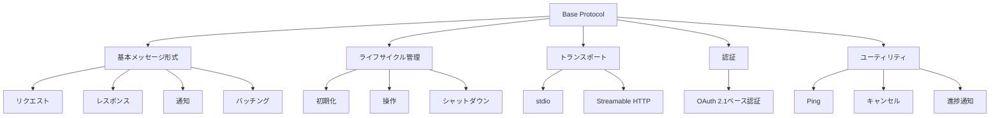
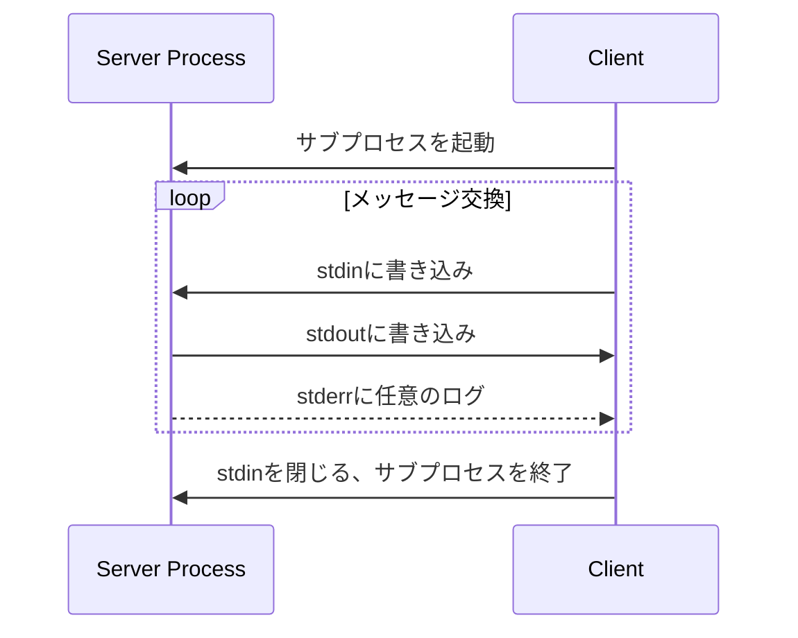
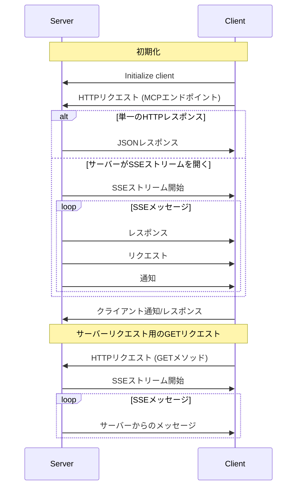
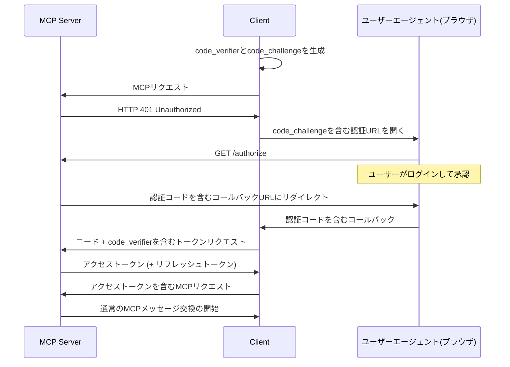
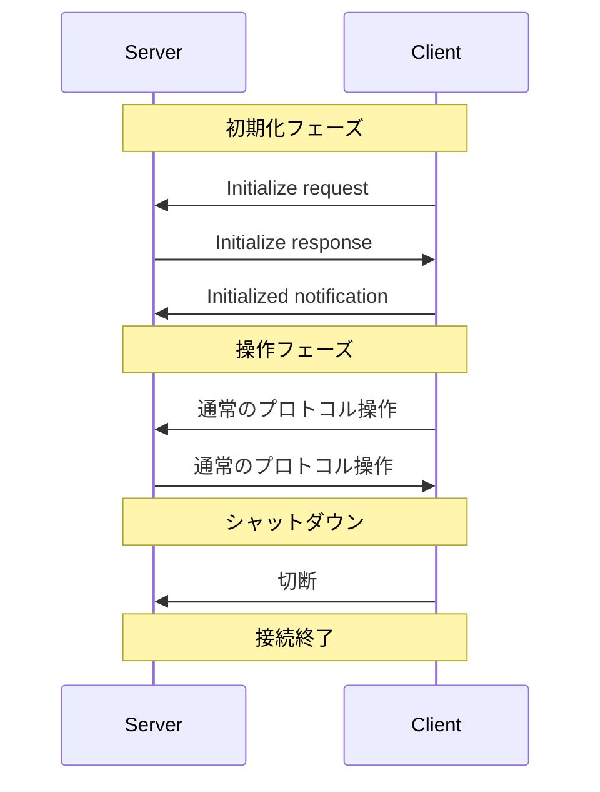

# Base Protocol

Model Context Protocol (MCP)の基本プロトコルは、クライアントとサーバー間の通信を可能にする基盤となるコンポーネントです。JSON-RPCメッセージ形式、ライフサイクル管理、トランスポート層などのコア機能を提供します。

## 概要



すべてのMCP実装は基本プロトコルとライフサイクル管理コンポーネントをサポートする**必須**があります。その他のコンポーネントはアプリケーションの特定のニーズに基づいて実装**できます**。

## メッセージ形式

MCPクライアントとサーバー間のすべてのメッセージは[JSON-RPC 2.0](https://www.jsonrpc.org/specification)仕様に従う**必要があります**。プロトコルは以下のタイプのメッセージを定義しています：

### リクエスト

リクエストは、操作を開始するためにクライアントからサーバーに、またはその逆に送信されます。

```json
{
  "jsonrpc": "2.0",
  "id": "string or number",
  "method": "string",
  "params": { "key": "value" }
}
```

- リクエストには文字列または整数のIDを含める**必須**です
- Base JSON-RPCとは異なり、IDは`null`であっては**なりません**
- リクエストIDは同じセッション内で送信者によって以前に使用されていては**なりません**

### レスポンス

レスポンスは、操作の結果またはエラーを含むリクエストへの返信として送信されます。

```json
{
  "jsonrpc": "2.0",
  "id": "string or number",
  "result": { "key": "value" }
}
```

または

```json
{
  "jsonrpc": "2.0",
  "id": "string or number",
  "error": {
    "code": number,
    "message": "string",
    "data": "optional data"
  }
}
```

- レスポンスには、対応するリクエストと同じIDを含める**必須**です
- レスポンスは**成功結果**または**エラー**のいずれかに分類されます。`result`または`error`のいずれかを設定する**必須**です。レスポンスは両方を設定しては**なりません**
- 結果は任意のJSON構造に従う**ことができます**が、エラーには少なくともエラーコードとメッセージを含める**必須**です
- エラーコードは整数である**必須**です

### 通知

通知はクライアントからサーバーへ、またはその逆に一方向メッセージとして送信されます。受信者は応答を送信して**はなりません**。

```json
{
  "jsonrpc": "2.0",
  "method": "string",
  "params": { "key": "value" }
}
```

- 通知にはIDを含めて**はなりません**

### バッチング

JSON-RPCは複数のリクエストと通知を配列内に送信することで[バッチ処理する手段](https://www.jsonrpc.org/specification#batch)も定義しています。MCP実装はJSON-RPCバッチの送信をサポートする**ことができます**が、JSON-RPCバッチの受信をサポートする**必須**です。

## トランスポート

MCPはJSON-RPCメッセージのエンコードに使用されます。JSON-RPCメッセージはUTF-8でエンコードする**必須**があります。

プロトコルは現在、クライアント-サーバー通信のための2つの標準トランスポートメカニズムを定義しています：

### stdio

stdioトランスポートでは：

- クライアントはMCPサーバーをサブプロセスとして起動します
- サーバーは標準入力（`stdin`）からJSON-RPCメッセージを読み取り、標準出力（`stdout`）にメッセージを送信します
- メッセージは改行で区切られ、埋め込まれた改行を含んで**はなりません**
- サーバーはログ記録目的で標準エラー（`stderr`）にUTF-8文字列を書き込む**ことができます**



### Streamable HTTP

Streamable HTTPトランスポートでは、サーバーは複数のクライアント接続を処理できる独立したプロセスとして機能します。このトランスポートはHTTP POSTおよびGETリクエストを使用します。サーバーはオプションで[Server-Sent Events](https://en.wikipedia.org/wiki/Server-sent_events) (SSE)を利用して、複数のサーバーメッセージをストリーミングできます。

- サーバーはPOSTとGETの両方のメソッドをサポートする単一のHTTPエンドポイントパス（**MCPエンドポイント**）を提供する**必須**があります
- クライアントからサーバーに送信されるすべてのJSON-RPCメッセージは、MCPエンドポイントへの新しいHTTP POSTリクエストである**必須**があります
- クライアントはMCPエンドポイントへのHTTP GETを発行して、SSEストリームを開き、サーバーからクライアントへの通信を可能にする**ことができます**



#### セッション管理

MCPの「セッション」は、[初期化フェーズ](/specification/2025-03-26/basic/lifecycle/)から始まるクライアントとサーバー間の論理的に関連する相互作用で構成されます。

- Streamable HTTPトランスポートを使用するサーバーは、`Mcp-Session-Id`ヘッダーを含めて、初期化時にセッションIDを割り当てる**ことができます**
- セッションIDはグローバルに一意で暗号的に安全である**必須**です（安全に生成されたUUIDなど）
- クライアントはサーバーがセッションIDを提供した場合、後続のすべてのHTTPリクエストに`Mcp-Session-Id`ヘッダーを含める**必須**です

## 認証

MCPはHTTPのトランスポートレベルで認証機能を提供し、MCPクライアントがリソース所有者の代わりに制限されたMCPサーバーにリクエストを行うことを可能にします。

### 認証フロー

認証は以下のプロセスに従います：

1. クライアントが認証されていないか、または検証されていない場合、サーバーは**HTTP 401 Unauthorized**で応答します
2. クライアントは[OAuth 2.1 IETF DRAFT](https://datatracker.ietf.org/doc/html/draft-ietf-oauth-v2-1-12)認証フローを開始します
3. ユーザーは認証情報を提供し、クライアントのアクセスを承認します
4. クライアントはアクセストークンを取得します
5. クライアントは後続のすべてのリクエストにそのトークンを含めます



### サーバーメタデータ検出

MCPクライアントはOAuth 2.0認証サーバーメタデータプロトコル（[RFC8414](https://datatracker.ietf.org/doc/html/rfc8414)）に従う**必須**があります。これにより、認証エンドポイントの自動検出が可能になります。

## ライフサイクル

Model Context Protocol (MCP)は、適切な機能ネゴシエーションと状態管理を確保するクライアント-サーバー接続のための厳格なライフサイクルを定義しています。

1. **初期化**：機能ネゴシエーションとプロトコルバージョン合意
2. **操作**：通常のプロトコル通信
3. **シャットダウン**：接続の正常な終了



### 初期化

初期化フェーズはクライアントとサーバー間の最初のやり取りである**必須**です。この段階で、クライアントとサーバーは：

- プロトコルバージョンの互換性を確立
- 機能を交換し、ネゴシエート
- 実装の詳細を共有

クライアントは以下を含む`initialize`リクエストを送信することでこのフェーズを開始する**必須**です：

- サポートされるプロトコルバージョン
- クライアント機能
- クライアント実装情報

```json
{
  "jsonrpc": "2.0",
  "id": 1,
  "method": "initialize",
  "params": {
    "protocolVersion": "2024-11-05",
    "capabilities": {
      "roots": { "listChanged": true },
      "sampling": {}
    },
    "clientInfo": {
      "name": "ExampleClient",
      "version": "1.0.0"
    }
  }
}
```

サーバーは独自の機能と情報で応答する**必須**です：

```json
{
  "jsonrpc": "2.0",
  "id": 1,
  "result": {
    "protocolVersion": "2024-11-05",
    "capabilities": {
      "logging": {},
      "prompts": { "listChanged": true },
      "resources": { "subscribe": true, "listChanged": true },
      "tools": { "listChanged": true }
    },
    "serverInfo": {
      "name": "ExampleServer",
      "version": "1.0.0"
    }
  }
}
```

### 機能ネゴシエーション

クライアントとサーバーの機能は、セッション中に利用可能になるオプションのプロトコル機能を確立します。

| カテゴリ | 機能 | 説明 |
|---------|------|------|
| **クライアント** | `roots` | ファイルシステムルートを提供する能力 |
| **クライアント** | `sampling` | LLMサンプリングリクエストのサポート |
| **クライアント** | `experimental` | 非標準の実験的機能のサポートを記述 |
| **サーバー** | `prompts` | プロンプトテンプレートを提供 |
| **サーバー** | `resources` | 読み取り可能なリソースを提供 |
| **サーバー** | `tools` | 呼び出し可能なツールを公開 |
| **サーバー** | `logging` | 構造化されたログメッセージを発行 |
| **サーバー** | `experimental` | 非標準の実験的機能のサポートを記述 |

## ユーティリティ

MCPの基本プロトコルは、オプションの一連のユーティリティによって拡張できます：

### Ping

Pingメカニズムにより、どちらかの側がカウンターパートがまだ応答しており、接続が生きていることを確認できます。

```json
// Pingリクエスト
{ "jsonrpc": "2.0", "id": "123", "method": "ping" }

// Pingレスポンス
{ "jsonrpc": "2.0", "id": "123", "result": {} }
```

### キャンセル

進行中のリクエストをキャンセルするためのメカニズムを提供します。キャンセルは通知を通じて行われます。

```json
// キャンセル通知
{
  "jsonrpc": "2.0",
  "method": "notifications/cancelled",
  "params": {
    "requestId": "123",
    "reason": "User requested cancellation"
  }
}
```

### 進捗通知

長時間実行される操作の進行状況を追跡するメカニズムを提供します。

```json
// 進捗トークンを含むリクエスト
{
  "jsonrpc": "2.0",
  "id": 1,
  "method": "some_method",
  "params": {
    "_meta": {
      "progressToken": "abc123"
    }
  }
}

// 進捗通知
{
  "jsonrpc": "2.0",
  "method": "notifications/progress",
  "params": {
    "progressToken": "abc123",
    "progress": 50,
    "total": 100,
    "message": "Reticulating splines..."
  }
}
```

---

元ページ：
- [Base Protocol – Model Context Protocol Specification](https://spec.modelcontextprotocol.io/specification/2025-03-26/basic/)
- [Transports – Model Context Protocol Specification](https://spec.modelcontextprotocol.io/specification/2025-03-26/basic/transports/)
- [Authorization – Model Context Protocol Specification](https://spec.modelcontextprotocol.io/specification/2025-03-26/basic/authorization/)
- [Lifecycle – Model Context Protocol Specification](https://spec.modelcontextprotocol.io/specification/2025-03-26/basic/lifecycle/)
- [Utilities – Model Context Protocol Specification](https://spec.modelcontextprotocol.io/specification/2025-03-26/basic/utilities/)
