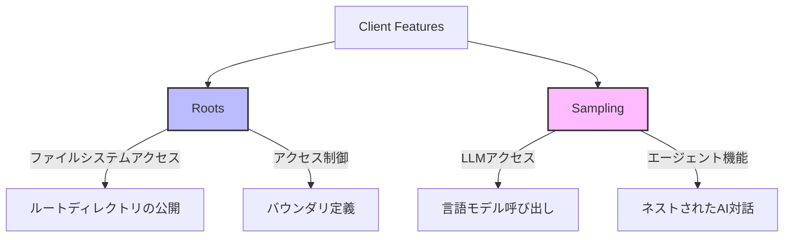
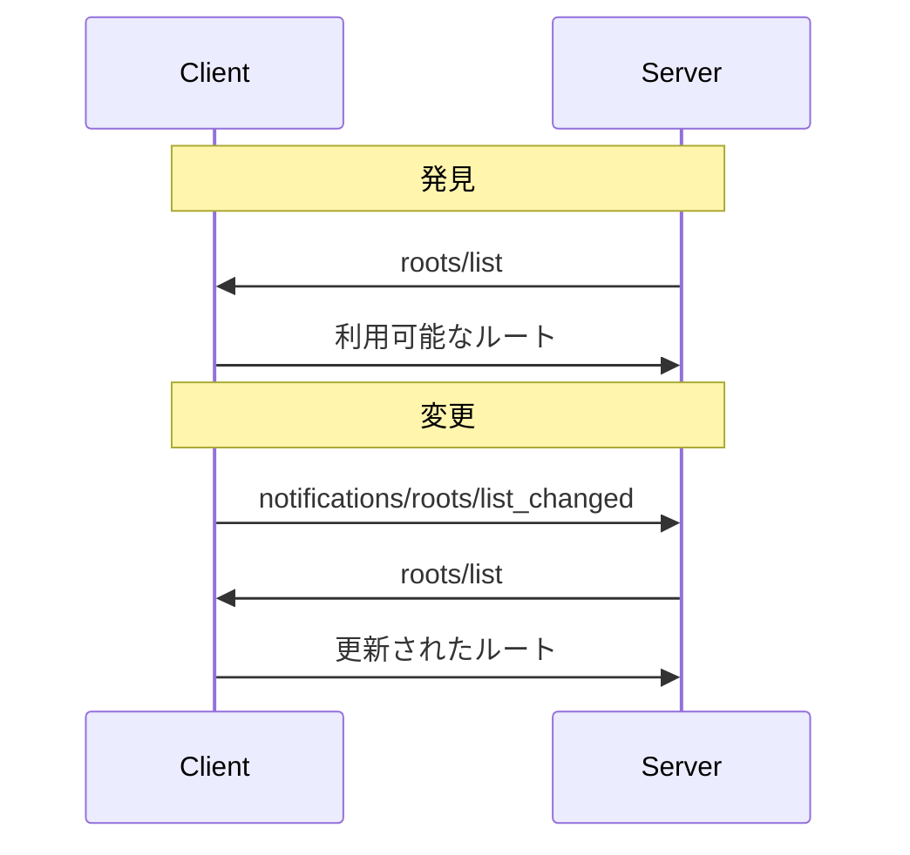
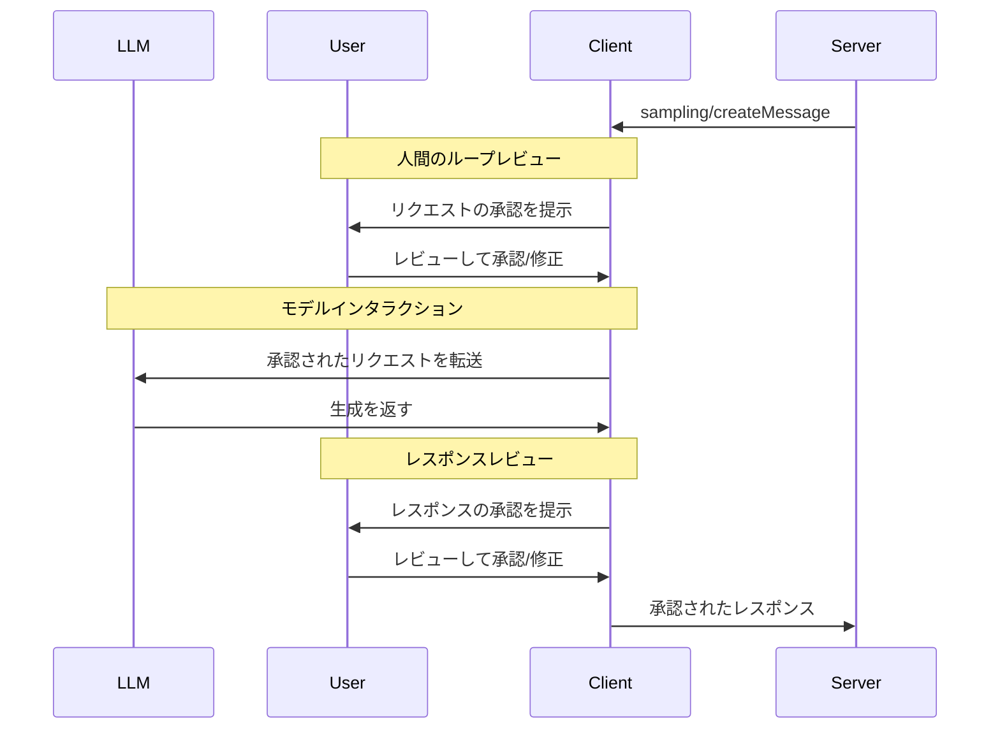

# Client Features

Model Context Protocol (MCP)のクライアント機能は、接続されたMCPサーバーを強化するための追加機能を提供します。これらの機能により、クライアントは固有の能力をサーバーに公開し、よりリッチなインタラクションを可能にします。

## 概要



MCPクライアント機能は次の2つの主要コンポーネントで構成されています：

1. **Roots**: サーバーがアクセス可能なファイルシステムの範囲を定義
2. **Sampling**: サーバーがクライアントを通じて言語モデルにアクセスすることを可能にする

## Roots（ルート）

Rootsは、クライアントがサーバーにファイルシステムの「ルート」を公開するための標準化された方法を提供します。ルートは、サーバーがファイルシステム内で操作できる境界を定義し、どのディレクトリやファイルにアクセスできるかを理解できるようにします。

### 機能

Rootsをサポートするクライアントは、初期化時に`roots`機能を宣言する**必須**があります：

```json
{
  "capabilities": {
    "roots": {
      "listChanged": true
    }
  }
}
```

`listChanged`は、ルートのリストが変更されたときにクライアントが通知を発行するかどうかを示します。

### メッセージフロー



### データ型

ルート定義には以下が含まれます：
- `uri`: ルートの一意の識別子。現在の仕様では`file://` URIでなければ**なりません**
- `name`: 表示目的のオプションの人間可読な名前

### 例

#### プロジェクトディレクトリ

```json
{
  "uri": "file:///home/user/projects/myproject",
  "name": "My Project"
}
```

#### 複数のリポジトリ

```json
[
  {
    "uri": "file:///home/user/repos/frontend",
    "name": "Frontend Repository"
  },
  {
    "uri": "file:///home/user/repos/backend",
    "name": "Backend Repository"
  }
]
```

### セキュリティに関する考慮事項

- クライアントは適切な権限を持つルートのみを公開する**必須**があります
- クライアントはパストラバーサルを防ぐためにすべてのルートURIを検証する**必須**があります
- クライアントは適切なアクセス制御を実装する**必須**があります
- サーバーはルートの境界を尊重する**べきです**

## Sampling（サンプリング）

Samplingは、サーバーがクライアントを介してLLMサンプリング（「補完」または「生成」）を言語モデルにリクエストするための標準化された方法を提供します。このフローにより、クライアントはモデルへのアクセス、選択、権限を制御しながら、サーバーがAI機能を活用できるようになります。サーバーAPIキーは必要ありません。

### 機能

Samplingをサポートするクライアントは、初期化時に`sampling`機能を宣言する**必須**があります：

```json
{
  "capabilities": {
    "sampling": {}
  }
}
```

### ユーザーインタラクションモデル

MCPでのサンプリングにより、サーバーは他のMCPサーバー機能の*内部に入れ子になった*LLM呼び出しを行うことで、エージェント的な振る舞いを実装できます。

信頼性と安全性のため、サンプリングリクエストを拒否できる**人間のループ**が常に存在する**べきです**。

アプリケーションは以下を**べきです**：
- サンプリングリクエストのレビューを簡単で直感的にするUIを提供する
- ユーザーが送信前にプロンプトを表示および編集できるようにする
- 配信前に生成されたレスポンスをレビューのために提示する

### メッセージフロー



### データ型

サンプリングメッセージには以下が含まれます：
- テキストコンテンツ: プレーンテキストメッセージ
- 画像コンテンツ: Base64エンコードされた画像データ
- 音声コンテンツ: Base64エンコードされた音声データ

### モデル選択

MCPではモデル選択に慎重な抽象化が必要です。サーバーとクライアントが異なるAIプロバイダーを使用し、異なるモデルの選択肢がある可能性があるためです。MCPでは、抽象的な能力の優先度とオプションのモデルヒントを組み合わせた選好システムを実装しています：

#### 能力優先度

サーバーは3つの正規化された優先度値（0-1）を通じてニーズを表現します：
- `costPriority`: コスト最小化の重要性。値が高いほど安価なモデルを優先
- `speedPriority`: 低レイテンシーの重要性。値が高いほど高速なモデルを優先
- `intelligencePriority`: 高度な能力の重要性。値が高いほど高性能なモデルを優先

#### モデルヒント

`hints`によりサーバーは特定のモデルやモデルファミリーを提案できます：
- ヒントはモデル名に柔軟に一致する部分文字列として扱われます
- 複数のヒントは優先順位順に評価されます
- クライアントは異なるプロバイダーからの同等のモデルにヒントをマッピングする**ことができます**
- ヒントは助言的なもの—最終的なモデル選択はクライアントが行います

```json
{
  "hints": [
    { "name": "claude-3-sonnet" }, // Sonnetクラスのモデルを優先
    { "name": "claude" }          // 任意のClaudeモデルにフォールバック
  ],
  "costPriority": 0.3,          // コストはそれほど重要ではない
  "speedPriority": 0.8,         // 速度は非常に重要
  "intelligencePriority": 0.5   // 中程度の能力ニーズ
}
```

クライアントはこれらの選好を処理して、利用可能なオプションから適切なモデルを選択します。例えば、クライアントがClaudeモデルにアクセスできないがGeminiを持っている場合、同様の機能に基づいてsonnetヒントを`gemini-1.5-pro`にマッピングする可能性があります。

### セキュリティに関する考慮事項

- クライアントはユーザー承認制御を実装する**べきです**
- 両当事者はメッセージ内容を検証する**べきです**
- クライアントはモデル選好ヒントを尊重する**べきです**
- クライアントはレート制限を実装する**べきです**
- 両当事者は機密データを適切に処理する**必須**です

---

元ページ：
- [Client Features – Model Context Protocol Specification](https://spec.modelcontextprotocol.io/specification/2025-03-26/client/)
- [Roots – Model Context Protocol Specification](https://spec.modelcontextprotocol.io/specification/2025-03-26/client/roots/)
- [Sampling – Model Context Protocol Specification](https://spec.modelcontextprotocol.io/specification/2025-03-26/client/sampling/)
