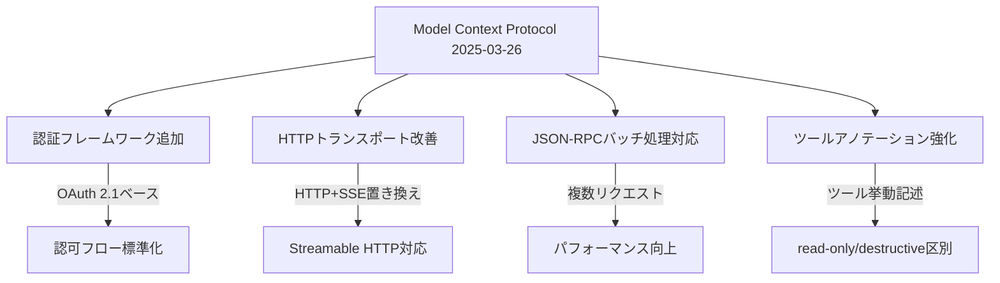

# Key Changes

このドキュメントは、Model Context Protocol（MCP）の2024-11-05から2025-03-26(Latest)への変更点をまとめたものです。

## 主要な変更点

### 主要な変更の詳細

| 変更項目 | 内容 | PR番号 |
|---------|------|-------|
| [認証フレームワーク](https://spec.modelcontextprotocol.io/specification/2025-03-26/basic/authorization/) | OAuth 2.1に基づく包括的な認証フレームワークを追加 | [#133](https://github.com/modelcontextprotocol/specification/pull/133) |
| [Streamable HTTPトランスポート](https://spec.modelcontextprotocol.io/specification/2025-03-26/basic/transports/#streamable-http) | 従来のHTTP+SSEトランスポートをより柔軟なStreamable HTTPトランスポートに置き換え | [#206](https://github.com/modelcontextprotocol/specification/pull/206) |
| [JSON-RPCバッチ処理](https://www.jsonrpc.org/specification#batch) | JSON-RPCバッチ処理のサポートを追加 | [#228](https://github.com/modelcontextprotocol/specification/pull/228) |
| ツールアノテーション | ツールの挙動をより詳細に記述するための包括的なアノテーションを追加（read-onlyか破壊的かなど） | [#185](https://github.com/modelcontextprotocol/specification/pull/185) |

## スキーマの変更点

- `ProgressNotification`に`message`フィールドを追加：状態更新の説明を提供
- オーディオデータのサポートを追加：既存のテキストや画像コンテンツタイプに加えて追加
- `completions`機能を追加：引数の自動補完候補のサポートを明示的に示すため

詳細は[更新されたスキーマ](http://github.com/modelcontextprotocol/specification/tree/main/schema/2025-03-26/schema.ts)を参照してください。

## 完全な変更履歴

前回のプロトコルリビジョンからのすべての変更リストは、[GitHubで確認できます](https://github.com/modelcontextprotocol/specification/compare/2024-11-05...2025-03-26)。

---

元ページ：[Key Changes – Model Context Protocol Specification](https://spec.modelcontextprotocol.io/specification/2025-03-26/changelog/)
