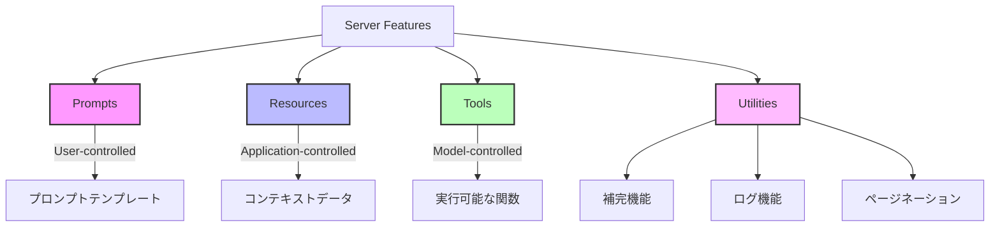
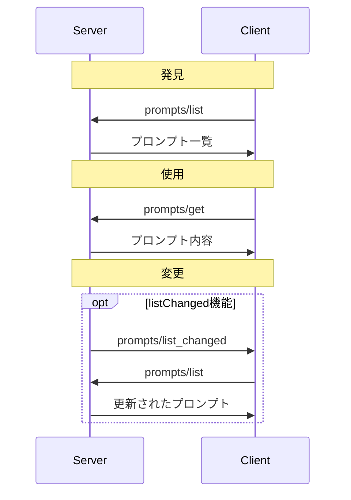
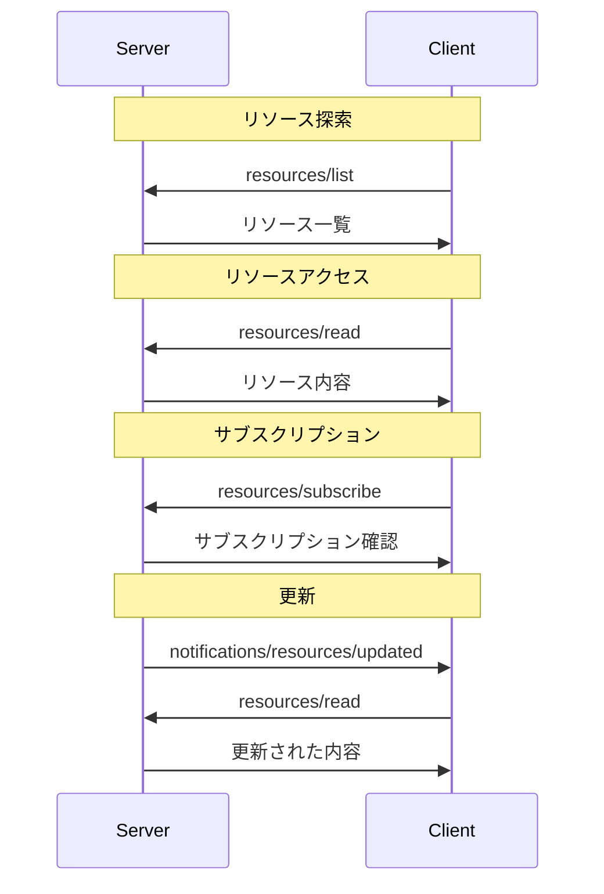
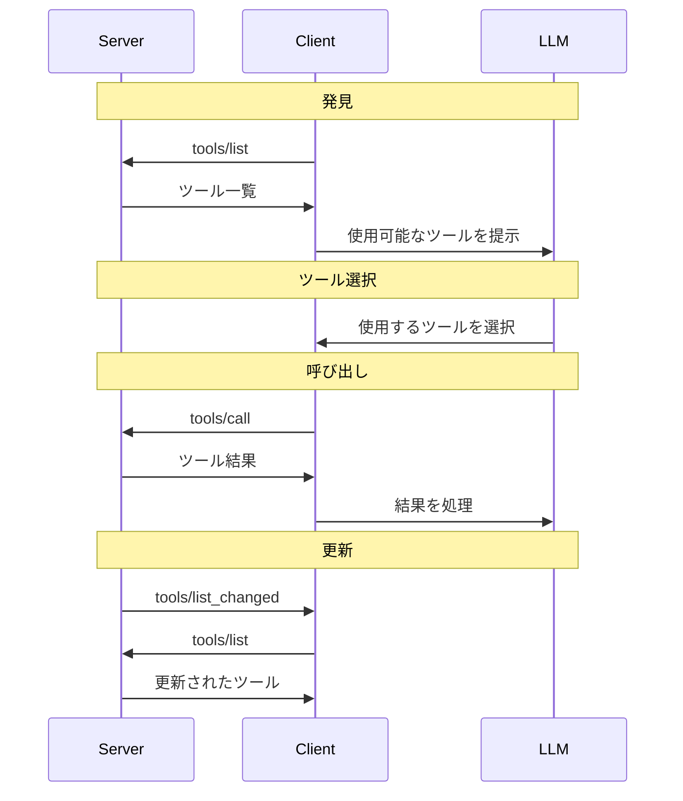

# Server Features

Model Context Protocol（MCP）のサーバー機能は、言語モデルにコンテキストを追加するための基本的な構成要素を提供します。これらの機能により、クライアント、サーバー、および言語モデル間でリッチなインタラクションが可能になります。

## 基本概念



## 制御階層

各基本要素は以下の制御階層に分類できます：

| 基本要素      | 制御                 | 説明                                                             | 例                                     |
| ------------- | -------------------- | ---------------------------------------------------------------- | -------------------------------------- |
| **Prompts**   | ユーザー制御         | ユーザーの選択によって呼び出されるインタラクティブなテンプレート | スラッシュコマンド、メニューオプション |
| **Resources** | アプリケーション制御 | クライアントによって管理されるコンテキストデータ                 | ファイル内容、Git 履歴                 |
| **Tools**     | モデル制御           | LLM がアクションを実行するために公開された関数                   | API POST リクエスト、ファイル書き込み  |

## Prompts（プロンプト）

プロンプトは、サーバーがクライアントに公開するテンプレートで、言語モデルとの対話のための構造化メッセージや指示を提供します。ユーザーがこれらを明示的に選択して使用することを意図しています。

### 機能

プロンプトをサポートするサーバーは、初期化時に`prompts`機能を宣言する**必須**があります：

```json
{
  "capabilities": {
    "prompts": {
      "listChanged": true
    }
  }
}
```

### メッセージフロー



### データ型

プロンプト定義には以下が含まれます：

- `name`: プロンプトの一意の識別子
- `description`: オプションの人間可読な説明
- `arguments`: カスタマイズのためのオプションの引数リスト

プロンプトメッセージには以下のコンテンツタイプが含まれます：

- テキストコンテンツ: プレーンテキストメッセージ
- 画像コンテンツ: Base64 エンコードされた視覚情報
- 音声コンテンツ: Base64 エンコードされた音声情報
- 埋め込みリソース: サーバー側のリソースへの直接参照

## Resources（リソース）

リソースは、サーバーがクライアントに共有するデータで、ファイル、データベーススキーマ、アプリケーション固有の情報など、言語モデルにコンテキストを提供します。各リソースは一意の URI で識別されます。

### 機能

リソースをサポートするサーバーは、`resources`機能を宣言する**必須**があります：

```json
{
  "capabilities": {
    "resources": {
      "subscribe": true,
      "listChanged": true
    }
  }
}
```

機能は 2 つのオプション機能をサポートします：

- `subscribe`: クライアントが個々のリソースの変更通知を購読できるかどうか
- `listChanged`: 利用可能なリソースのリストが変更されたときにサーバーが通知を発行するかどうか

### メッセージフロー



### データ型

リソース定義には以下が含まれます：

- `uri`: リソースの一意の識別子
- `name`: 人間可読な名前
- `description`: オプションの説明
- `mimeType`: オプションの MIME タイプ
- `size`: オプションのバイト単位のサイズ

リソースはテキストまたはバイナリデータを含むことができます：

- テキストコンテンツ: プレーンテキスト
- バイナリコンテンツ: Base64 エンコードされたデータ

### 一般的な URI スキーム

プロトコルはいくつかの標準 URI スキームを定義しています：

- `https://`: ウェブ上で利用可能なリソース
- `file://`: ファイルシステムのようなリソース
- `git://`: Git バージョン管理の統合

## Tools（ツール）

ツールは、言語モデルが呼び出すことができるサーバーが公開する関数です。ツールにより、モデルは外部システムと対話できます（データベースのクエリ、API の呼び出し、計算の実行など）。各ツールは名前で一意に識別され、そのスキーマを記述するメタデータが含まれています。

### 機能

ツールをサポートするサーバーは、`tools`機能を宣言する**必須**があります：

```json
{
  "capabilities": {
    "tools": {
      "listChanged": true
    }
  }
}
```

`listChanged`は、利用可能なツールのリストが変更されたときにサーバーが通知を発行するかどうかを示します。

### メッセージフロー



### データ型

ツール定義には以下が含まれます：

- `name`: ツールの一意の識別子
- `description`: 機能の人間可読な説明
- `inputSchema`: 期待されるパラメータを定義する JSON スキーマ
- `annotations`: ツールの動作を記述するオプションのプロパティ

ツール結果は異なるタイプの複数のコンテンツ項目を含むことができます：

- テキストコンテンツ
- 画像コンテンツ
- 音声コンテンツ
- 埋め込みリソース

### セキュリティに関する考慮事項

信頼性と安全性のため：

- ユーザーがツールの呼び出しを拒否できる**人間のループ**が常に存在する**べきです**
- クライアントは信頼されたサーバーから来ない限り、ツールのアノテーションを信頼していない**必須**です

## Utilities（ユーティリティ）

サーバー機能には、サーバー機能を強化するための追加のユーティリティが含まれています：

### Completion（補完）

プロンプトやリソース URI の引数の自動補完候補をサーバーが提供するための標準化された方法。これにより、ユーザーが引数値を入力する際にコンテキスト候補を受け取ることができる豊かな IDE 風の体験が可能になります。

補完をサポートするサーバーは、`completions`機能を宣言する**必須**があります：

```json
{
  "capabilities": {
    "completions": {}
  }
}
```

### Logging（ログ記録）

サーバーが構造化されたログメッセージをクライアントに送信できるようにする機能。

### Pagination（ページネーション）

大規模なリストレスポンスで使用されるページネーションのためのユーティリティ。

---

元ページ：

- [Server Features – Model Context Protocol Specification](https://spec.modelcontextprotocol.io/specification/2025-03-26/server/)
- [Prompts – Model Context Protocol Specification](https://spec.modelcontextprotocol.io/specification/2025-03-26/server/prompts/)
- [Resources – Model Context Protocol Specification](https://spec.modelcontextprotocol.io/specification/2025-03-26/server/resources/)
- [Tools – Model Context Protocol Specification](https://spec.modelcontextprotocol.io/specification/2025-03-26/server/tools/)
- [Utilities – Model Context Protocol Specification](https://spec.modelcontextprotocol.io/specification/2025-03-26/server/utilities/)
